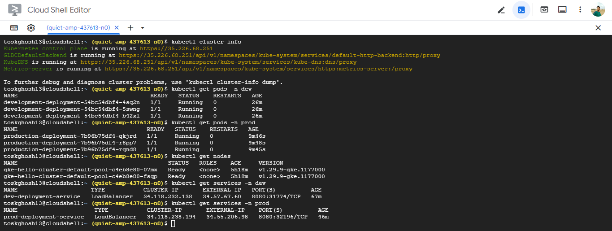
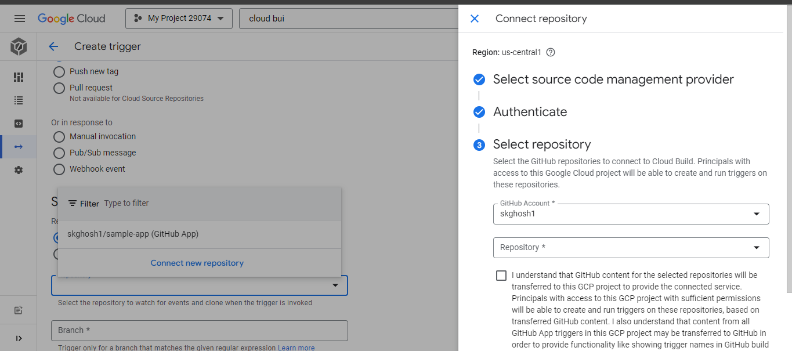
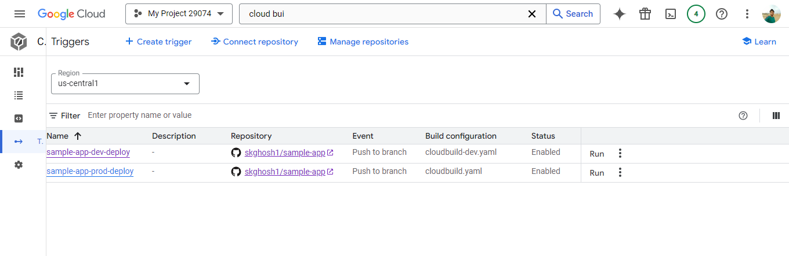
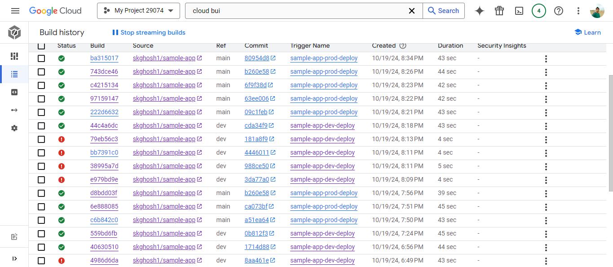
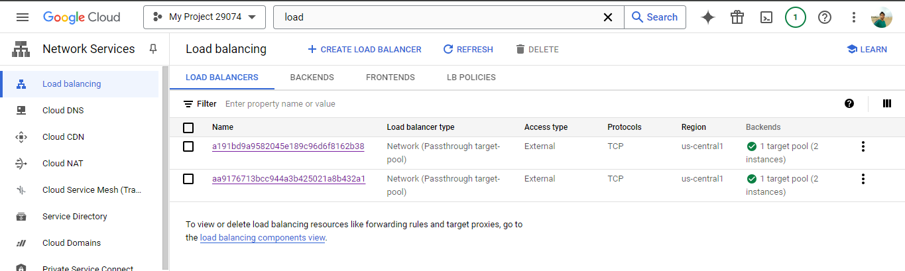
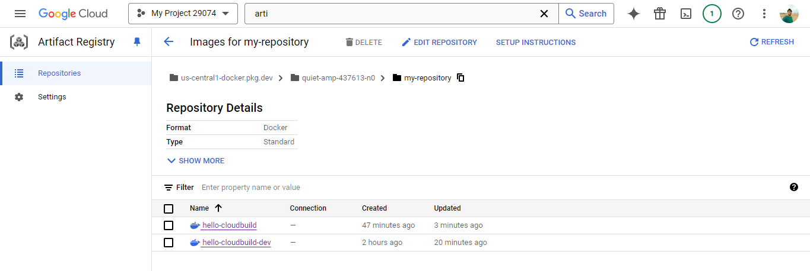
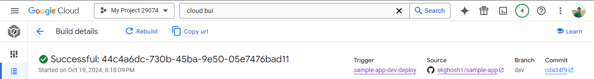
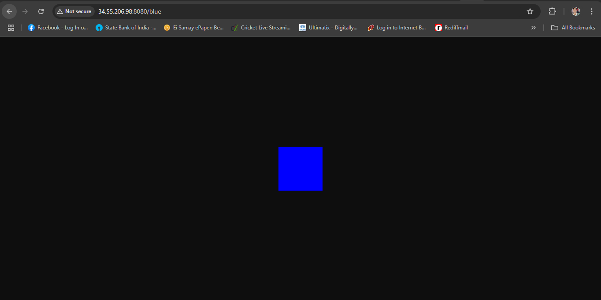

# sample-app
**Creating a simple CI/CD pipeline using Cloud Source Repositories, Artifact Registry, and Cloud Build.**

Creating a GKE cluster based on a set of configurations provided.

Creating a GItHub Repository to host your Go application code.

Creating Cloud Build Triggers that deploy a production and development application.

Pushing updates to the app and creating new builds.

Expose the production-deployment deployment on the prod namespace to a LoadBalancer service named prod-deployment-service on port 8080, and set the target port of the container to the one specified in the Dockerfile.

Building Artifacts:

Rolling back the production application to a previous version.

Final web page:

